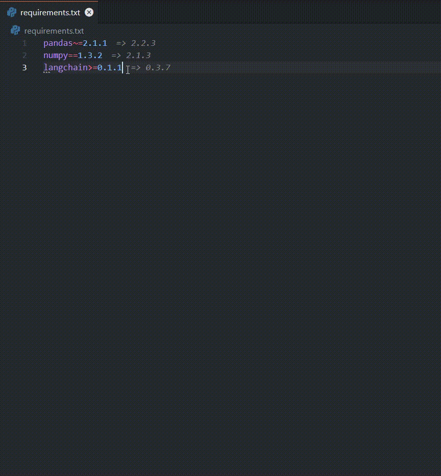

# Python Packages Handler

Python Packages Handler is a Visual Studio Code extension that helps you manage, update, and install Python package versions in your `requirements.txt` files.

## Features

- Update a single Python package to its latest version
- Update all Python packages in a `requirements.txt` file to their latest versions
- Update and install a single Python package
- Update and install all Python packages in a `requirements.txt` file
- Preserves existing version specifiers (e.g., `~=`, `>=`, `==`, etc.)
- Accessible via right-click context menu in `requirements.txt` files
- Shows the latest available version for each package after the package line

## Installation

1. Open Visual Studio Code
2. Go to the Extensions view (Ctrl+Shift+X or Cmd+Shift+X on macOS)
3. Search for "Python Packages Handler"
4. Click Install

## Usage

### Video Tutorial

Here's a quick demonstration of how to use the Python Packages Handler extension:

### Viewing Latest Available Versions

1. Open a `requirements.txt` file in VS Code
2. The latest available version for each package will be displayed after the package line

### Updating a Single Package

1. Open a `requirements.txt` file in VS Code
2. Right-click on the line containing the package you want to update
3. Select "Update Python Package Version" from the context menu

### Updating All Packages

1. Open a `requirements.txt` file in VS Code
2. Right-click anywhere in the file
3. Select "Update All Python Packages" from the context menu

### Updating and Installing a Single Package

1. Open a `requirements.txt` file in VS Code
2. Right-click on the line containing the package you want to update and install
3. Select "Update and Install Python Package" from the context menu

### Updating and Installing All Packages

1. Open a `requirements.txt` file in VS Code
2. Right-click anywhere in the file
3. Select "Update and Install All Python Packages" from the context menu

## Requirements

- Visual Studio Code version 1.60.0 or higher
- Internet connection (to fetch latest package versions from PyPI)
- Python and pip installed on your system (for installation features)

## Extension Settings

This extension doesn't add any VS Code settings.

## Release Notes

### 0.0.4
- Added feature to show latest available version for each package after the package line
- Improved performance and reliability

### 0.0.3
- Supported older versions of VSCode
- Improved the README file
- Cleaned up the code

### 0.0.2
- Bug fixes
- Added feature to update and install a single package
- Added feature to update and install all packages in a file

### 0.0.1
Initial release of Python Packages Handler
- Feature to update a single package
- Feature to update all packages in a file
- Context menu integration

## Contributing

Contributions are welcome! Please feel free to submit a Pull Request.

## License

This extension is licensed under the [MIT License](LICENSE.md).

## Author

Created and maintained by [Ahmad Einieh](https://github.com/ahmad-einieh)